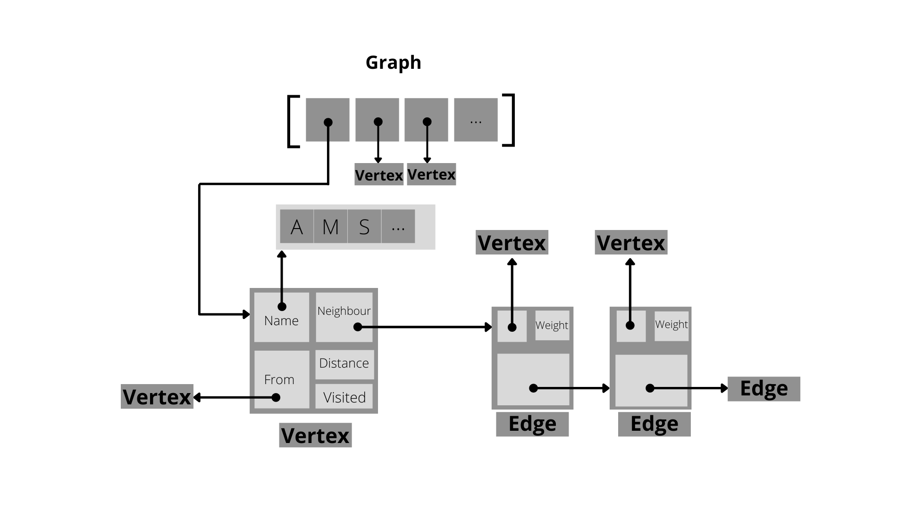

# Trains
NS, like C program. That uses Dijkstra to calculate the distance between 2 stations..but made interesting.

> If you wish to take a deep dive into all the work that went into making this code. Please have a look at the [Programming Report](resources/programming_report.pdf) (included in the repo) I made.
A pic that describes the structure of the code 

This program contains 2 programs :

1. A program that calculates the distance between 2 stations / points using Dijkstra's algorithm (Using linked lists, because Matrices are for pussies).
2. An extension program that prints the graph in the terminal

In both programs, the code is made to be very flexible and user friendly.
The graph is therefore read from an external `.txt` file. That must have the name `railNetwork.txt`.

One great thing about this approach is that the program or the extension program only have to compiled once. But be run many times, with the same graph. Of course, the fact that you do not have to input the graph using the terminal each time you have to use the program. Which is huge if the graph is huge.

 The syntax is as following:

    <stations  name>
    <stations  name>
    <cost of  connection>
    .
    .
    Amsterdam
    Den Haag
    46

 To make sure that your input in the `.txt` file has no errors, you can user the program to print your whole graph in your terminal.

 To do so do the following :
    
    > make graph
    > ./graph

 To use to other program and calculate the distance between 2 stations :

    > make main
    > ./main

 The program will now accept your input. First you have to inform the program how many disruptions occurred in your graph / rail network. If you want to wish to no have any disruptions then input 0. Of course inputting
any number > 0 means you have to input the 2 stations where the disruption
happened.

After that the program will wait for your input consisting of the 2 stations
you wish to know the closest distance between them. Simply input your start
stations then `ENTER`, and then the goal stations followed by another `ENTER`.
This should yield the stations/stops/route you need to take to have closest distance/time between the two stations. The character `!` will terminate the program.

Other uses :

    > make test

> Will test the program using the `testCase1.txt`.

    > make time

> Linux only: Will tell you the time it took to test `testCase1.txt`

    > make debug

> runs the program using `Valgrind`

    > make clean

> will remove the `graph` and `main` files from the working directory.